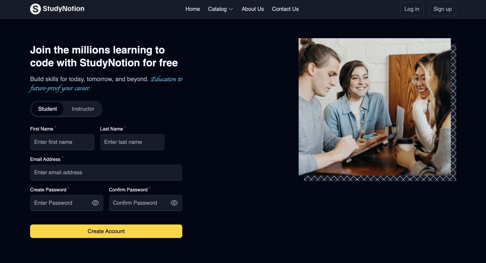
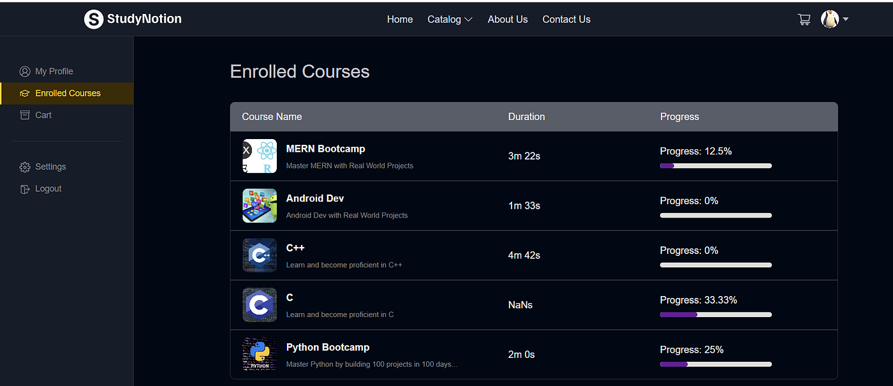
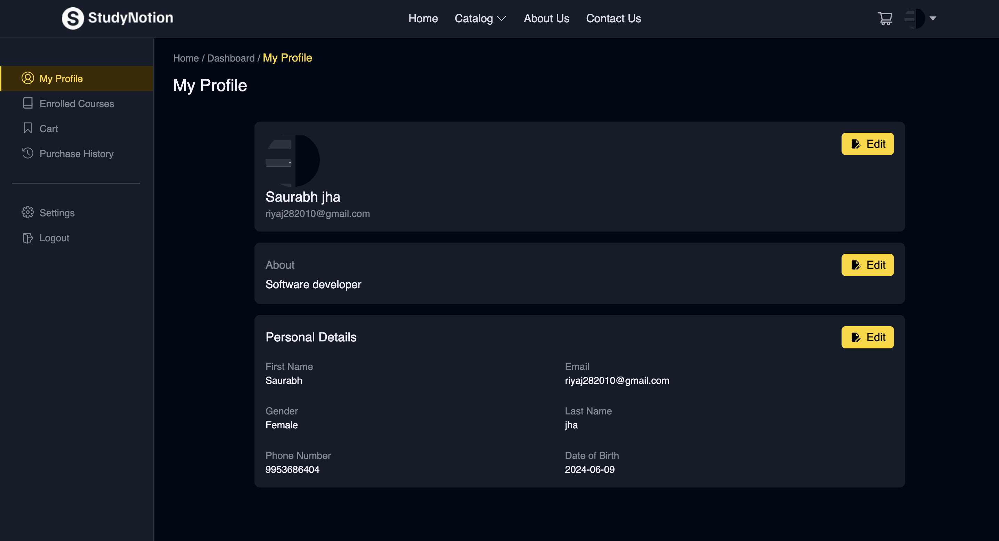
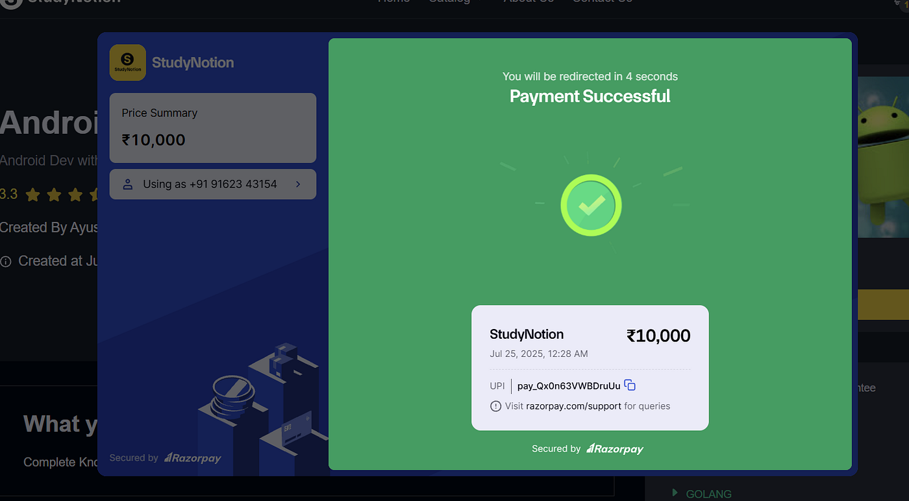
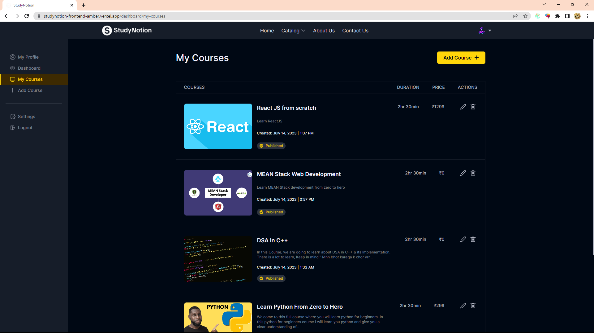

# **Edtech Platform (StudyNotion)**

A full-stack learning management system where instructors create and manage courses, and students enroll, watch video lessons, track progress, and make payments using Razorpay.

---

## **Project Overview**

- **Type**: Full-stack MERN application (React + Express + MongoDB)
- **Purpose**: Marketplace-style LMS with role-based access (Student, Instructor, Admin)
- **Core Workflow**:
  1. Students sign up with OTP verification
  2. Browse courses by category
  3. Enroll via Razorpay payment gateway
  4. Watch video lessons organized in sections/subsections
  5. Track course completion progress
  6. Rate and review courses

---

## **Key Features**

### **Authentication & Authorization**
- Email + OTP-based signup (using otp-generator)
- Secure login with JWT tokens (2-hour expiry)
- Password reset via email link
- Role-based route protection (Student, Instructor, Admin)
- Password change endpoint

### **Course Management**
- Instructors create/edit/delete courses with:
  - Thumbnail upload (via Cloudinary)
  - Course description and learning objectives
  - Price and status (Draft/Published)
  - Organized content structure (Sections → SubSections)
  - Video uploads with duration tracking
- Admin approval workflow for instructors
- Course categories and filtering
- Rating & review system for students

### **Student Features**
- Course discovery and catalog browsing
- Enrollment with payment processing (Razorpay)
- Video player with progress tracking (completed videos)
- Course dashboard with enrolled courses
- Download course materials
- Rate and review courses

### **Payment Integration**
- Razorpay order creation and verification
- Secure payment signature validation
- Automatic student enrollment after successful payment
- Payment confirmation emails (Nodemailer)
- Support for multiple course enrollment in single transaction

### **Media & File Management**
- Cloudinary integration for image/video uploads
- Automatic thumbnail generation
- Secure file upload endpoints
- Temporary file cleanup

### **Communication**
- Transactional emails via Nodemailer:
  - OTP verification emails
  - Course enrollment confirmation
  - Payment success notifications
  - Password reset emails
  - Password change notifications

---

## **Tech Stack**

| Layer | Technology | Details |
|-------|-----------|---------|
| **Frontend** | React 18, Redux Toolkit, TailwindCSS | `npm start` runs dev server |
| **Backend** | Node.js, Express.js | `npm run server` runs on port 4000 |
| **Database** | MongoDB, Mongoose | Schema-based ODM |
| **Authentication** | JWT (jsonwebtoken) | 2-hour token expiry |
| **File Upload** | express-fileupload, Cloudinary | Image/video uploads |
| **Payments** | Razorpay SDK | Order & payment verification |
| **Email** | Nodemailer | Transactional emails |
| **Form Validation** | react-hook-form | Frontend form handling |
| **UI Components** | react-icons, react-rating-stars, react-super-responsive-table | Table & UI elements |
| **Video Player** | video-react | Video playback |
| **Animations** | react-type-animation, swiper | Carousel & text effects |
| **Dev Tools** | nodemon, concurrently | Development workflow |

---

## **Project Structure**

```
Edtech-Platform/
├── server/                      # Backend (Express API)
│   ├── index.js                # Server entry (PORT 4000)
│   ├── config/
│   │   ├── database.js         # MongoDB connection
│   │   ├── cloudinary.js       # Cloudinary setup
│   │   └── razorpay.js         # Razorpay instance
│   ├── controllers/            # Business logic
│   │   ├── Auth.js             # Signup, login, password management
│   │   ├── Course.js           # Course CRUD & course details
│   │   ├── Payments.js         # Payment & enrollment
│   │   ├── Profile.js          # User profile updates
│   │   ├── Section.js          # Course sections
│   │   ├── SubSection.js       # Video subsections
│   │   ├── Categories.js       # Course categories
│   │   ├── RatingAndReview.js  # Reviews
│   │   ├── ResetPassword.js    # Password reset
│   │   └── courseProgress.js   # Progress tracking
│   ├── models/                 # MongoDB schemas
│   │   ├── User.js
│   │   ├── Course.js
│   │   ├── Section.js
│   │   ├── SubSection.js
│   │   ├── CourseProgress.js
│   │   ├── RatingAndReview.js
│   │   ├── Category.js
│   │   ├── OTP.js
│   │   └── Profile.js
│   ├── routes/                 # API endpoints
│   │   ├── User.js             # /api/v1/auth
│   │   ├── Profile.js          # /api/v1/profile
│   │   ├── Course.js           # /api/v1/course
│   │   └── Payments.js         # /api/v1/payment
│   ├── middlewares/
│   │   └── auth.js             # JWT verification, role checks
│   ├── utils/
│   │   ├── imageUploader.js    # Cloudinary upload logic
│   │   ├── mailSender.js       # Nodemailer setup
│   │   └── secToDuration.js    # Video duration formatter
│   ├── mail/templates/         # Email templates
│   │   ├── emailVerificationTemplate.js
│   │   ├── courseEnrollmentEmail.js
│   │   ├── paymentSuccessEmail.js
│   │   ├── passwordUpdate.js
│   │   └── contactFormRes.js
│   └── package.json
│
├── src/                        # Frontend (React App)
│   ├── index.js               # React entry
│   ├── App.js                 # Main app component
│   ├── components/
│   │   ├── common/            # Reusable components (Navbar, Footer, etc.)
│   │   ├── core/              # Page-specific components
│   │   │   ├── Auth/          # Login, Signup, OTP pages
│   │   │   ├── HomePage/      # Home page sections
│   │   │   ├── Catalog/       # Course listing
│   │   │   ├── Course/        # Course details & sections
│   │   │   ├── Dashboard/     # Student & instructor dashboards
│   │   │   └── ViewCourse/    # Video player & lesson view
│   │   └── ContactPage/       # Contact form
│   ├── pages/                 # Route pages
│   │   ├── Home.js
│   │   ├── Signup.jsx
│   │   ├── Login.jsx
│   │   ├── Catalog.jsx
│   │   ├── CourseDetails.js
│   │   ├── Dashboard.js
│   │   ├── ViewCourse.js
│   │   ├── ForgotPassword.js
│   │   ├── VerifyEmail.js
│   │   ├── UpdatePassword.js
│   │   └── Error.jsx
│   ├── services/              # API calls
│   │   ├── apiconnector.js    # Axios instance
│   │   ├── apis.js            # API endpoints
│   │   └── operations/        # Business logic wrappers
│   │       ├── authAPI.js
│   │       ├── profileAPI.js
│   │       ├── courseDetailsAPI.js
│   │       ├── studentFeaturesAPI.js
│   │       ├── SettingsAPI.js
│   │       └── pageAndComponentData.js
│   ├── slices/                # Redux state management
│   │   ├── authSlice.js
│   │   ├── cartSlice.js
│   │   ├── profileSlice.js
│   │   ├── courseSlice.js
│   │   └── viewCourseSlice.js
│   ├── utils/                 # Helper functions
│   │   ├── constants.js       # API URLs, timeouts
│   │   ├── avgRating.js
│   │   ├── dateFormatter.js
│   │   └── secToDurationFrontend.js
│   ├── data/                  # Static data
│   │   ├── navbar-links.js
│   │   ├── footer-links.js
│   │   ├── dashboard-links.js
│   │   ├── homepage-explore.js
│   │   └── countrycode.json
│   ├── hooks/
│   │   └── useOnClickOutside.js
│   ├── assets/                # Images & logos
│   │   ├── Images/
│   │   ├── Logo/
│   │   └── TimeLineLogo/
│   ├── App.css
│   ├── index.css              # TailwindCSS imports
│   ├── package.json
│   └── tailwind.config.js
│
├── public/                     # Static assets
│   ├── index.html
│   ├── manifest.json
│   └── robots.txt
│
├── package.json               # Root scripts (concurrently)
├── tailwind.config.js
└── README.md
```

---

## **Installation & Setup**

### **1. Clone the Repository**
```bash
git clone https://github.com/Mohhit1230/Edtech-Platform.git
cd Edtech-Platform
```

### **2. Install Dependencies**

**Option A: Install all at once (recommended for local dev)**
```bash
npm install
cd server && npm install && cd ..
```

**Option B: Install separately**
```bash
# Root dependencies (for running concurrently)
npm install

# Backend dependencies
cd server
npm install
cd ..

# Frontend dependencies (if needed)
cd src
npm install
cd ..
```

### **3. Create Environment Files**

**In `server/.env`:**
```bash
MONGODB_URL=your_mongodb_url
JWT_SECRET=your_secret_key
CLOUD_NAME=your_cloud_name
API_KEY=your_api_key
API_SECRET=your_api_secret
FOLDER_NAME=studynotion
RAZORPAY_KEY=your_razorpay_key
RAZORPAY_SECRET=your_razorpay_secret
MAIL_USER=your_email@gmail.com
MAIL_PASS=your_app_password
```

### **4. Run the Application**

**Development Mode (Frontend + Backend concurrently):**
```bash
npm run dev
```
This will start:
- **Frontend**: http://localhost:3000 (React dev server)
- **Backend**: http://localhost:4000 (Express API)

**Backend Only:**
```bash
cd server
npm run dev
```

**Frontend Only:**
```bash
npm start
```

### **5. Build for Production**

```bash
# Build React app
npm run build

# Output: build/ folder with optimized files

# Start backend (production)
cd server
npm start
```
## **Screenshots & Demo**

### 1. Home Page - Landing Screen

*Main landing page with "Empower Your Future with Coding Skills" headline, "Learn More" and "Book a Demo" CTAs, and featured course developer image.*

### 2. Signup Page

*Student/Instructor account creation form with First Name, Last Name, Email, Password fields, and role selector (Student/Instructor). Includes promotional image of collaborative learning.*

### 3. Enrolled Courses - Student Dashboard

*Student dashboard showing all enrolled courses with course name, duration, and progress tracking. Examples: MERN Bootcamp (12.5%), Android Dev (0%), C++, C, Python Bootcamp with progress bars.*

### 4. My Profile - Student Settings

*User profile page displaying personal information including name, email, about section, personal details (First Name, Last Name, Gender, Phone Number, Date of Birth) with Edit buttons.*

### 5. Payment Success

*Payment confirmation screen showing successful ₹10,000 course enrollment with Razorpay payment receipt (UPI, Order ID, Timestamp) and auto-redirect countdown.*

### 6. Instructor Dashboard - My Courses

*Instructor management dashboard displaying created courses (React JS from scratch, MEAN Stack Web Development, DSA in C++, Learn Python) with duration, price (₹1299, ₹0), edit and delete actions, and "Add Course" button.*

---


**Created by**: Mohhit1230 
**Last Updated**: August 2025  
**Repository**: [Mohhit1230/Edtech-Platform](https://github.com/Mohhit1230/Edtech-Platform)
